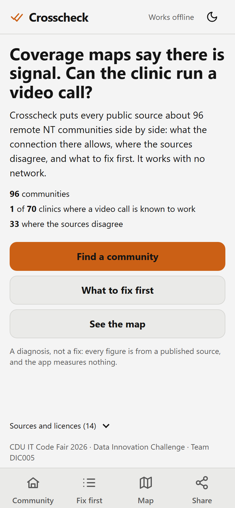
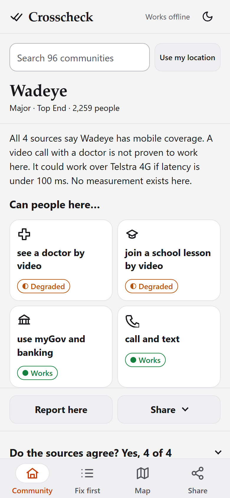
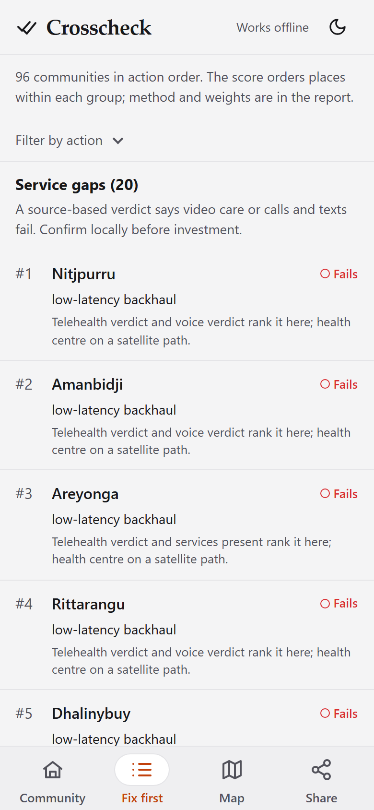
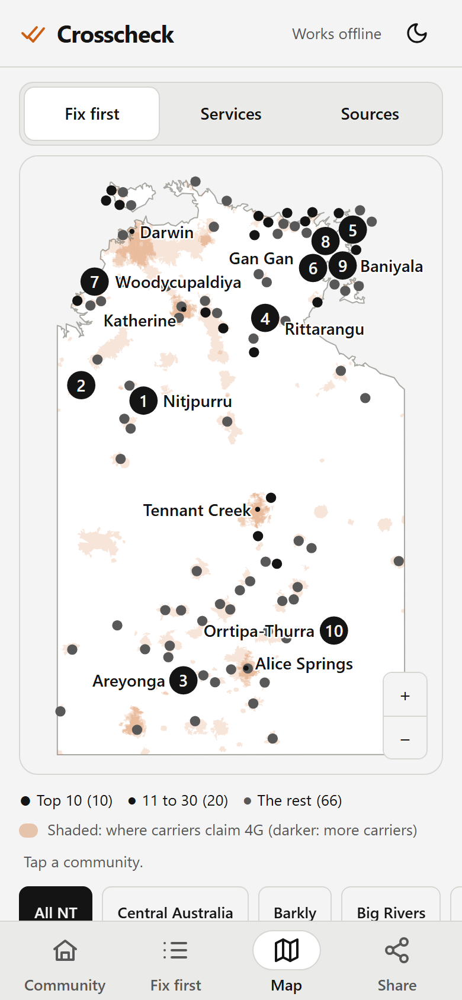

# Crosscheck

Crosscheck compares published connectivity claims for 96 remote Northern Territory communities. It shows what those claims imply for everyday services, where the sources disagree, and where to check or act first. The app works offline; it does not measure signal or prove a service works at a particular building.

**CDU IT Code Fair 2026 · Data Innovation Challenge · Remote Connectivity · Team DIC005**

<p align="center">
  
</p>

## Explore

Crosscheck is a single-file web app, live at **[estaed.github.io/CDU_IT_CODEFAIR_DATA_2026](https://estaed.github.io/CDU_IT_CODEFAIR_DATA_2026/)**. Open it once online and it keeps working offline on that phone; the same file also opens straight from disk. [Build it locally](#reproduce) to check it against the source. The camera route sends an updated data pack to a phone that already has Crosscheck; it does not install the app on a new phone.

| View | Question it answers |
|---|---|
| **Community** | What do the sources say here, and what do they imply for telehealth, school video, myGov text and voice/SMS? |
| **Fix first** | Which communities have source-based service gaps, which need evidence checked, and who could act? |
| **Map** | Where do the patterns sit across the NT? |
| **Share** | How can someone carry a summary or data update without a network? |

| Community | Fix first | Map |
|:---:|:---:|:---:|
|  |  |  |

These are screenshots of the built app from 28 September 2026. [Both themes and the Share screen](design/shots/) are also available.

## The challenge and our approach

The [Data Innovation Challenge brief](https://itcodefair.cdu.edu.au/data-innovation-challenge/) asks teams to identify connectivity gaps, explain them clearly, combine data sources, consider ethical and community impacts, and work in low-connectivity settings. Crosscheck addresses those aims with a cited Python pipeline, an offline prototype, and a report prepared to the [organiser's format](https://itcodefair.cdu.edu.au/data-innovation-challenge-requirement/).

The committed [data pack](data/out/data_pack.json), built 27 September 2026, covers **96 communities**, including **70 with a clinic**. It identifies **1** where a clinic video call is known to work from published evidence and **33** where coverage sources disagree (counting the five sources that make a claim; the report's four-publisher breakdown gives 31). These are outputs of stated rules and source snapshots, not on-site measurements. A small reliability model and a transparent priority score run during the Python build; the phone only displays their outputs. [Findings and limitations](docs/FINDINGS.md) explain the satellite latency assumption, sparse drive tests, model validation and small-population suppression.

The organiser judges datasets, creativity and originality, technical sophistication, contextual relevance and practicality, ethical considerations, and presentation. The final submission deadline is **30 September 2026**; the in-person presentation is **7 October 2026**. The project is complete. The [report PDF](docs/report/DataChallenge_Team%20DIC005_Report.pdf) and its [editable source](docs/report/README.md) are in this repository; the slide deck travels with the submission zip.

The submission holds the four deliverables the organiser calls for: the **PDF data analysis report**, the **presentation deck**, the **interactive prototype** (`index.html`, also live at the address above), and the **Python source** with these reproduction instructions. The requirement page specifies a 5-minute deck; Challenge Day allows a 10-minute pitch plus 5 minutes of questions. The [report requirements](docs/report-requirements.md) record the format and the difference between those two instructions.

## Evidence and limits

- The [provenance register](data/out/PROVENANCE.md) lists each source, retrieval date, licence status and attribution. Raw snapshots are not committed.
- A service verdict is inferred from published inputs. **Fails** means the published path does not meet the cited requirement; a clinic might have an unpublished link.
- The National Audit shows a nearby drive-test contradiction for three communities. Reliability words elsewhere are model estimates, not local measurements or calibrated probabilities.
- The committed pack includes derived BushTel and National Audit fields with attribution; the [provenance register](data/out/PROVENANCE.md) records their current reuse status.
- A **Report here** entry stays on the person's phone unless they choose to share it. It never changes a source-based verdict.

## Reproduce

Run from the repository root with Python 3.13 and [uv](https://docs.astral.sh/uv/). In Windows PowerShell (on macOS or Linux use `export PYTHONUTF8=1` and `.venv/bin/python`):

```powershell
$env:PYTHONUTF8 = '1'
uv sync
.venv/Scripts/python -m playwright install chromium
.venv/Scripts/python scripts/build_app.py
.venv/Scripts/python scripts/gate.py
```

The committed pack is enough to build `dist/index.html` and run its browser tests (`.venv/Scripts/python -m pytest -m browser`) without raw-data downloads. The full gate runs Ruff, unit tests, the build and size checks, then Playwright against the built file with nonlocal requests blocked; the source and pack unit tests read `data/raw/`, so the gate is green only once the snapshots below are fetched. `dist/` is generated and ignored by Git.

To reproduce the data pack, fetch the publisher snapshots into ignored `data/raw/` with the modules under [`pipeline/fetch/`](pipeline/fetch/) (one per source: ABS boundaries, ACCC, ACMA RRL, BushTel, NBN, NT Government, National Audit, Mobile Black Spot Program; about 4.5 GB, most of it ACCC coverage KML), then run:

```powershell
.venv/Scripts/python scripts/run_pipeline.py
.venv/Scripts/python scripts/gate.py
```

The source register and fetch modules describe the required snapshot set. Downloads need network access and may have changed since the cited run. `run_pipeline.py` itself reads local files without a network request and names the fetch command for any missing snapshot. The first ACCC KML parse can be slow; its cache is ignored by Git.

## Repository guide

| Path | Purpose |
|---|---|
| [`docs/PRD.md`](docs/PRD.md) | Product scope, decisions and ethical constraints |
| [`docs/FINDINGS.md`](docs/FINDINGS.md) | Generated findings and evidence tables |
| [`pipeline/`](pipeline/) | Sources, verdict rules, reliability model and priority order |
| [`data/out/`](data/out/) | Derived tables, pack, figures and provenance |
| [`app/`](app/) | Offline app and camera transfer |
| [`design/shots/`](design/shots/) | Built-app screenshots in both themes |
| [`docs/report/`](docs/report/) | Competition report (PDF and editable source) and figures |
| [`tests/`](tests/) | Unit and offline browser checks |

No repository-wide reuse licence has been granted for the original code or third-party data. Check each source's terms before reusing it.
