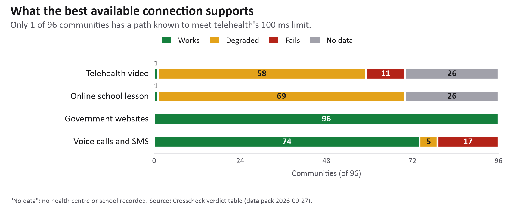
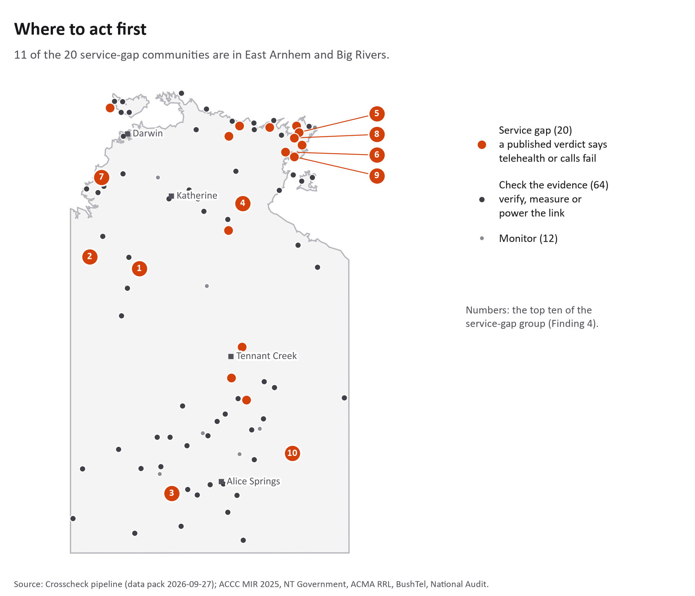

**CDU IT Code Fair 2026**

**Data Innovation Challenge**

**Crosscheck**

**A tool to find and fix connectivity gaps in 96 remote NT communities**

**Team Number: DIC005**

| **Student Name** | **Student ID** | **Role** |
| --- | :---: | --- |
| Tarik Bulut | S382893 | Data pipeline, app development, technical architecture |
| Huu Thanh Le | S378046 | Priority scoring, action framework, data analysis |
| Thi Xuan Thanh Tran | S389244 | Report, slides, pitch, documentation lead |
| Ngoc Anh Nguyen | S386805 | Ethics and community considerations, future work |

CHARLES DARWIN UNIVERSITY

Faculty of Science and Technology

30 September 2026

**Table of Contents**

1. Summary
2. Introduction
3. Methodology
4. Findings
5. Discussion
6. Recommendations
7. References

Appendix

# Summary

In the remote Northern Territory, a coverage map that says "connected" does not tell a clinic whether it can hold a video call with a doctor. Coverage data comes from several bodies that use different methods and dates, and they often disagree, so decision-makers struggle to know where to invest first.

Crosscheck brings five sources together for 96 remote NT communities: four published coverage claims and one government drive test. It checks the claims against each other and tests each community's best available connection against what telehealth video, online school lessons, government websites and voice calls need.

Only 1 of 96 communities has a connection known to meet healthdirect's latency requirement for video calls. In 33 communities the five sources disagree about whether there is mobile coverage at all, and in 17 no public source records any mobile voice or SMS path.

Crosscheck turns this into an action list: service gaps first, then evidence to check, then communities to monitor. Every community gets one named action and one responsible agency, and the order does not depend on any single weight. The app works fully offline on a phone.

# Introduction

**The problem**

A nurse at a remote clinic tries to connect a patient with a specialist in Darwin. The video freezes, twice. The government coverage map shows her community as "connected", but the connection is far too slow for a video call, so the patient waits another week for the next visiting doctor. Across the 96 communities in this study, connectivity carries healthcare, education, government services and emergency calls; when it fails, diagnoses are delayed, lessons are missed and people are cut off during floods and cyclones.

**Why the data makes it worse**

Four bodies publish their own view of mobile coverage: carriers' predicted coverage (reported by the ACCC), the NT Government's community list, the ACMA licence register and BushTel community profiles. Their methods, dates and definitions of "covered" differ, so they often disagree. A fifth source, the National Audit of Mobile Coverage, is measured by a vehicle driving and recording signal, but it passes within 5 km of very few NT communities.

**What Crosscheck does**

Crosscheck puts these sources side by side and asks a more useful question than "is there coverage?": is the best available connection good enough for a telehealth call, an online lesson, a government website or a phone call? It rates how far each claim can be trusted, ranks the communities and names one action and one agency for each. It is built for an NT Government analyst or a field officer, and it runs on a phone without internet.

# Methodology

The Python pipeline in the submission reproduces every step. Thresholds and weights live in plain configuration files, and every figure in this report is read from the pipeline's output tables.

**Step 1: Bringing the data together**

Crosscheck uses five of the eight datasets the organisers listed, and three further public datasets:

| **Dataset** | **What it provides** | **Date** |
| --- | --- | --- |
| NT Remote Areas Mobile Coverage (NT Government lists 2019, 2021, 2022; small-cell sites) * | Communities listed as having coverage; 2019 backhaul type | lists to Jul 2022 |
| ACCC Mobile Infrastructure Report 2025 * | Carriers' predicted 3G/4G/5G outdoor coverage (modelled, not measured) | 2025 |
| ACMA Register of Radiocommunications Licences * | Licensed transmitter sites within 5 km | fetched Sep 2026 |
| NBN coverage footprints (fixed line, fixed wireless) * | Whether a community has a fixed or fixed-wireless path | Mar 2024 |
| ABS ASGS Edition 3 boundaries * | Territory and SA3 regions, used for mapping and model validation | 2021 |
| BushTel community profiles | The 96 communities, their services (health centre, school, store and so on) and population | fetched Sep 2026 |
| National Audit of Mobile Coverage | Measured drive-test tiles where signal did not match carrier maps | May 2026 |
| Mobile Black Spot Program funded base stations | Towers already funded near a community | fetched Sep 2026 |

\* Listed by the organisers. The ADII dashboard and the Bureau of Meteorology cyclone reports are built into the scoring but held at zero weight until their licence requests are answered.

Only the National Audit is a measurement; the carrier maps are predictions, and the NT Government list has not changed since 2022.

**Step 2: Testing whether the connection is good enough**

For each community Crosscheck finds the best available path (fixed line, fixed wireless, terrestrial mobile or satellite) and tests it against each service's published requirement:

- **Telehealth video (healthdirect):** latency of 100 ms or less. The ACCC measured nbn's Sky Muster satellite at 664.9 ms on average. A satellite community "fails" unless a carrier's 4G footprint covers it; then it is "degraded", because 4G could work but no one has measured it there.
- **Online school lesson (Microsoft Teams):** at least 150 kbps upload. Sky Muster offers up to 5 Mbps, but Microsoft publishes no latency figure, so satellite schools are "degraded".
- **Government websites (myGov, Centrelink):** no published requirement; treated as working on any connection.
- **Voice and SMS:** whether any source records a mobile path.

**Step 3: Rating how far each coverage claim can be trusted**

A small logistic regression model (scikit-learn) ranks how reliable a coverage claim is. It learns from the National Audit's drive tests: 3,919 sample points along audited roads, 111 of which lie where the drive test found no signal inside a carrier's claimed coverage (a 2.8% base rate). Inputs include nearby licensed transmitters and how many sources claim coverage. Validated by holding out whole ABS SA3 regions, with a pass mark fixed before the first fit, the pooled out-of-region AUC is 0.79; two of the five folds held no contradicted samples, so this rests on three. Each community gets a word, not a probability: high, medium or low reliability, or none when no source claims coverage.

**Step 4: Grouping and ranking communities for action**

Communities are first grouped by their verdicts: **service gap** (20; telehealth or voice fails on the published data), **check the evidence** (64) and **monitor** (12). Within each group, a score between 0 and 1 orders them: the weighted sum of nine components, each scaled to 0–1 across the 96.

| **Component** | **Weight** |
| --- | :---: |
| Population (log scale) | 0.20 |
| Services present (health centre counted twice) | 0.20 |
| Telehealth verdict | 0.20 |
| Voice and SMS verdict | 0.15 |
| Claim reliability (low counts most) | 0.10 |
| Drive-test contradiction within 5 km | 0.10 |
| Funded mobile tower within 5 km (counted against) | −0.10 |
| Cyclone exposure (awaiting BoM licence) | 0 |
| ADII digital inclusion (awaiting licence) | 0 |

The weights are a judgement, so we tested them: moving any single weight to half or one-and-a-half times its value keeps all 10 of the top 10 in place (Spearman's rho at least 0.995). Each community's action comes from fixed rules (Finding 5), not from the weights.

**Step 5: The offline app**

The results ship as a web app of about 1 MB that runs in any phone browser without internet. One phone can pass an updated version to another by showing a loop of QR codes, with no Wi-Fi, data or Bluetooth. "Report here" lets residents save their phone's rough connection estimate and share it by QR code or SMS if they choose. The app computes no verdict and runs no model. It is live at https://estaed.github.io/CDU_IT_CODEFAIR_DATA_2026/.

# Findings

**Finding 1: One in three communities has conflicting coverage data**

Of the 96 communities, the four published claims all agree on coverage for 54 and on no coverage for 11; for 31 they disagree. The app counts only sources that make a claim and adds the drive test as a fifth, which gives the 33 communities with conflicting data shown on its home screen. The most common disagreement (8 communities) is a licensed site within 5 km that no carrier map, government list or BushTel record shows. The drive test confirms the problem: within 5 km of Nauiyu, Jilkminggan and Barunga it found no signal inside a carrier's claimed coverage.

**Finding 2: Telehealth video depends on an unmeasured link almost everywhere**

*Figure 1. Verdicts for four everyday services across the 96 communities.*

"No data" means no health centre or school is recorded there. 95 of 96 communities have only satellite for fixed internet, and its 664.9 ms delay breaks video calls. Only one community has a fixed-line path known to meet the 100 ms limit; in 58, telehealth depends on an unmeasured 4G link, and 11 health-centre communities have no 4G footprint at all. "Connected" on a map is not "able to see a doctor online".

Voice is more urgent. In 17 communities (1,140 people, 8 with a health centre) no public source records a mobile voice or SMS path, so mobile calls neither leave nor reach them. Landlines and satellite phones are not in any source used here.

**Finding 3: Many coverage claims are not backed by measurement**

Reliability ratings across the 96: high 8 communities (about 2,325 people), medium 29 (about 15,598), low 37 (about 17,536) and none 22 (about 1,596). Low ratings share a pattern: several sources say "covered" but few licensed transmitters stand nearby, which suggests predicted coverage has been extended where the signal was never confirmed.

**Finding 4: The communities most in need of action**

The service-gap group comes first, and it is concentrated: 11 of its 20 communities are in East Arnhem and Big Rivers (Figure 2). Its top ten all have a health centre on a satellite-only path where telehealth fails, and eight of them have no recorded mobile voice path either:

| **Rank** | **Community** | **Region** | **Score** | **Action** | **Who should act** |
| :---: | :---: | :---: | :---: | :---: | :---: |
| 1 | Nitjpurru | Big Rivers | 0.608 | Low-latency backhaul | DCDD, nbn |
| 2 | Amanbidji | Big Rivers | 0.596 | Low-latency backhaul | DCDD, nbn |
| 3 | Areyonga | Central Australia | 0.586 | Low-latency backhaul | DCDD, nbn |
| 4 | Rittarangu | Big Rivers | 0.526 | Low-latency backhaul | DCDD, nbn |
| 5 | Dhalinybuy | East Arnhem | 0.525 | Low-latency backhaul | DCDD, nbn |
| 6 | Gan Gan | East Arnhem | 0.523 | Low-latency backhaul | DCDD, nbn |
| 7 | Woodycupaldiya | Top End | 0.502 | Low-latency backhaul | DCDD, nbn |
| 8 | Gurrumuru | East Arnhem | 0.500 | Low-latency backhaul | DCDD, nbn |
| 9 | Baniyala | East Arnhem | 0.489 | Low-latency backhaul | DCDD, nbn |
| 10 | Orrtipa-Thurra | Central Australia | 0.483 | Low-latency backhaul | DCDD, nbn |

The evidence-check group follows, led by larger communities whose link is unverified or fragile rather than missing: Nauiyu (verify on the ground), Galiwinku (backup power), Maningrida (measure the link), Wurrumiyanga and Milingimbi (backup power).

*Figure 2. The 96 communities by action group; numbers mark the top ten of the service-gap group; shading shows where the carriers' maps claim 4G (ACCC MIR 2025).*

**Finding 5: Eight actions cover all 96 communities**

| **Action** | **Communities** | **With a health centre** | **Who should act** |
| :---: | :---: | :---: | :---: |
| Measure the link here | 31 | 31 | DCDD |
| Backup power | 15 | 15 | Carrier |
| Refresh the coverage list | 14 | 8 | DCDD |
| Low-latency backhaul | 12 | 12 | DCDD, nbn |
| Monitor | 12 | 1 | DCDD |
| Verify and publish the licensed site | 5 | 0 | Carrier, ACMA |
| Mobile site (MBSP nomination) | 4 | 0 | DCDD, carrier |
| Verify on the ground | 3 | 3 | DCDD, carrier |

The most common action, "measure the link here", covers 31 health-centre communities whose non-satellite link has never had its performance published. It needs no construction, only a measurement at the clinic, and no well-founded investment decision can be made without it.

# Discussion

**Respecting First Nations data rights**

Almost all 96 communities are First Nations communities. Following the CARE Principles for Indigenous Data Governance (Collective benefit, Authority to control, Responsibility, Ethics), BushTel profiles are used only for structural facts and their text is not reproduced until BushTel confirms its reuse terms, and the drive-test data only trains the model, never judging an individual community. Two sources carry no stated licence and requests are on file; the ADII and cyclone components stay at zero weight until theirs are confirmed.

**Avoiding the "deficit map"**

A map of red dots ("telehealth fails", "no voice") can make disadvantage look like a trait of the community rather than a failure of infrastructure. Crosscheck gives every community a named action and a named agency, so the problem belongs to an organisation that can fix it, and "Report here" makes residents contributors rather than subjects.

**What the verdicts and the model can and cannot tell us**

A "fails" verdict is inferred from published inputs, not observed on site: 95 of 96 verdicts rest on one measured satellite latency figure, and a clinic may use a government link no public dataset records. A reliability word is a rank, not a probability, and outside the three drive-tested communities it is an extrapolation. The right response to a low rating is to measure. The app states these limits next to every verdict.

**Protecting community privacy**

Crosscheck collects no personal information. Population is never shown for communities under 100 people (29 communities). A "Report here" location, if included, is rounded to about 1 km and never leaves the phone unless the user shares it.

# Recommendations

**For the NT Government (DCDD)**

- Visit Nauiyu, Jilkminggan and Barunga, where the government's own drive test contradicts carrier coverage. This costs travel time, not capital.
- Measure the links at the 31 "measure the link here" communities, all of which have a health centre.
- Use the service-gap group for the next Mobile Black Spot Program round; four communities with no voice path and no nearby site are ready for nomination.
- Update the NT Government coverage list, unchanged since July 2022, which misses predicted coverage in 14 communities.

**For mobile carriers (Telstra, Optus, TPG)**

- At the 15 "backup power" communities the mobile site depends on microwave backhaul (NT Government 2019 list), which fails when a relay loses power. Backup power is cheaper than a new tower and protects about 9,950 people and 15 health centres.
- Confirm and publish whether the licensed sites near five communities are active.

**For nbn and DCDD**

- The 12 health centres on satellite-only paths cannot run telehealth on Sky Muster's 664.9 ms. They need a low-latency link: the ACCC measured low-Earth-orbit satellite (Starlink) at 29.8 ms, or a terrestrial link. Sky Muster's faster plans do not change latency.

**For data publishers**

- Publish measured latency and throughput per community, not only predicted footprints; one set of clinic measurements would replace most of this report's stated assumptions.

# References

ACCC (2024). Broadband performance of satellite services measured for the first time (media release 147/24). Australian Competition and Consumer Commission. https://www.accc.gov.au/media-release/broadband-performance-of-satellite-services-measured-for-the-first-time

ACCC (2025). Mobile Infrastructure Report 2025: outdoor coverage maps. CC BY 2.5 AU. https://data.gov.au/data/dataset/4b472a18-d0fa-409c-994a-ab17162bcb90

ACMA (2026). Register of Radiocommunications Licences: licence data. https://www.acma.gov.au/radiocomms-licence-data

ABS (2021). Australian Statistical Geography Standard (ASGS) Edition 3: State and Territory, SA3 and UCL boundaries. CC BY 4.0. https://www.abs.gov.au/statistics/standards/australian-statistical-geography-standard-asgs-edition-3

BushTel (2026). Community profiles. Northern Territory Government. https://bushtel.nt.gov.au/

Carroll, S. R., Herczog, E., Hudson, M., Russell, K., & Stall, S. (2021). Operationalizing the CARE and FAIR Principles for Indigenous data futures. *Scientific Data*, 8, 108. https://doi.org/10.1038/s41597-021-00892-0

Department of Infrastructure, Transport, Regional Development, Communications, Sport and the Arts (2026). National Audit of Mobile Coverage: non-alignment data, May 2026. https://www.infrastructure.gov.au/media-communications-arts/internet/mobile-coverage-programme/national-audit-mobile-coverage

Department of Infrastructure, Transport, Regional Development, Communications, Sport and the Arts (2026). Mobile Black Spot Program: funded base stations. CC BY 4.0. https://data.gov.au/data/dataset/mobile-black-spot-program-mbsp

healthdirect Australia (2026). Video Call: bandwidth and data usage. https://help.vcc.healthdirect.org.au/technical-basics/bandwidthdatausage

Microsoft (2026). Prepare your organization's network for Teams. Microsoft Learn. Retrieved 12 September 2026, from https://learn.microsoft.com/en-us/microsoftteams/prepare-network

nbn co (2024). nbn fixed-line and fixed-wireless coverage footprints. CC BY 4.0. https://data.gov.au/data/dataset/9005c4ad-fc82-4f3f-a54e-bc6c62bbc45e

nbn co (2026). Sky Muster Plus explained. https://www.nbnco.com.au/learn/network-technology/sky-muster-explained/sky-muster-plus-explained

NT Government (2019, 2021, 2022). Remote communities with mobile coverage; Remote sites with small cell coverage. CC BY. https://data.nt.gov.au/dataset/mobile-phone-coverage-in-remote-areas-of-the-nt

Pedregosa, F., et al. (2011). Scikit-learn: Machine learning in Python. *Journal of Machine Learning Research*, 12, 2825–2830.

# Appendix

**AI usage declaration**

Claude (Anthropic) and Codex (OpenAI) were used as coding assistants to build the data pipeline and the offline application; scikit-learn was used for the reliability model in Step 3. All verdicts and priority scores come from a deterministic, rule-based pipeline, no AI model runs inside the shipped app, and AI was not used to generate or alter any underlying data, measurements or figures.

**Source code**

The full Python source and a README with reproduction instructions are in the submitted zip file and at https://github.com/Estaed/CDU_IT_CODEFAIR_DATA_2026. The interactive prototype runs at https://estaed.github.io/CDU_IT_CODEFAIR_DATA_2026/ and as index.html in the zip.

**Dataset links**

Every dataset is listed with its URL and licence in the References; fetch dates, sizes and attribution lines are in data/out/PROVENANCE.md in the source code.
